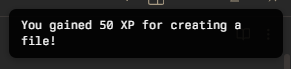

# Obsidian RPG Plugin

This plugin is a work in progress. It is designed to gameify the process of writing and organizing notes in Obsidian. The plugin tracks time spent with your vault open and rewards you with experience points. You gain extra experience points for the amount of notes you have in your vault. Your experience points are tracked directly and under a level system.

I want to eventually replicate something like [vscode-pets](https://marketplace.visualstudio.com/items?itemName=tonybaloney.vscode-pets) but for Obsidian. You'll be able to upgrade your pet and unlock new pets as you level up.

## Installation

1. Open your Obsidian vault folder in a terminal and navigate to `.obsidian/plugins`.
2. Clone this repository into the plugins folder: `git clone git@github.com:name/obsidian-rpg.git`.
3. Reload Obsidian and enable the plugin in the settings.
4. The plugin will start tracking your time and experience points immediately.

## Settings

1. Open your Obsidian settings and navigate to the "Obsidian RPG" tab.

- **XP gained per second**: The amount of experience points you gain per second with your vault open.
- **XP gained per file**: The amount of experience points you gain per note in your vault.
- **Reset XP and level**: Resets your experience points and level to 1. (This does not delete/modify your notes.)
